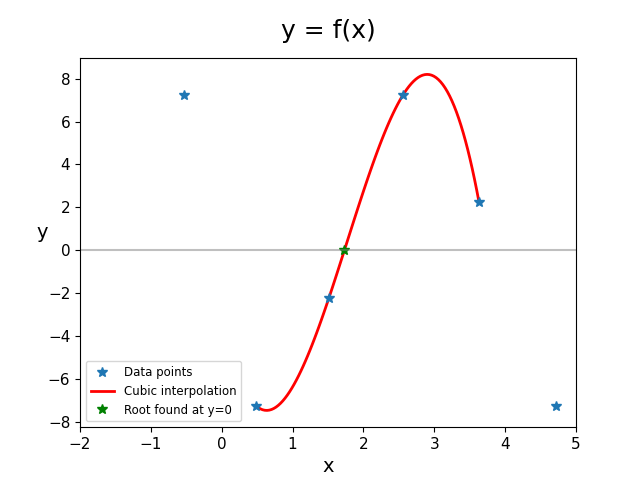

Interpolation and root finding
==============================

My Role
-------

I implemented numerical methods for cubic interpolation and root finding, along with creating visualisations of the mathematical results.

### Summary:

- **Implemented Cubic Interpolation** 
Developed a Python class (`Cubic`) and used Lagrange's interpolation formula to fit a cubic polynomial through given data points. The implementation included:
  - Efficient calculation of Lagrange basis polynomials.
  - Vectorised evaluation of the interpolating polynomial.
  - Clean abstraction of mathematical operations.

- **Root Finding with Regula Falsi** 
Implemented the Regula Falsi method to find roots of the interpolated cubic function, featuring:
  - Bracketing method for guaranteed convergence.
  - Precision control with stopping criterion `|f(x)| < 1e-5`.
  - Robust sign checking for interval updates.

- **Numerical Robustness** 
Ensured mathematical safety through:
  - Proper handling of edge cases in interpolation.
  - Careful management of floating-point precision.
  - Validation of input data ranges.

- **Code Quality**  
Produced well-structured, documented code featuring:
  - Type hints for better readability.
  - Comprehensive docstrings.
  - Modular design with reusable components.
  - Advanced Python features (list comprehensions, unpacking).

- **Data Visualisation** 
Created comprehensive plots showing:
  - Original data points as scatter plot.
  - Interpolated cubic curve.
  - Found root location at `y=0`.
  - Reference `y=0` line for context.

    

Lecturer Feedback
-----------------
The project received excellent feedback with an overall score of **90%**:

> "Your cubicfit function has the correct input and output arguments and you have implemented the Lagrange polynomial interpolation formula correctly."

> "I can see that you are very comfortable with coding in python and have excellent knowledge of python structures beyond that taught in the course."

> "Your code is well structured and commented and you have managed to write functions that fit the requirements of the brief while also using your own advanced python knowledge to write more general code - well done!"

#### Areas for Improvement:
- Root finding implementation needed more precise sign checking.
- Could simplify some advanced Python features for more general readability.s