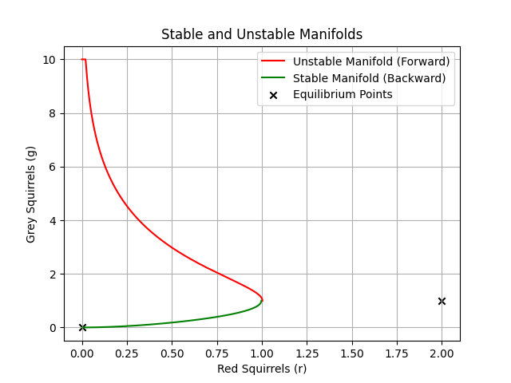

Group project on population dynamics: model of competition between species
==========================================================================

My Role
-------

I was responsible for implementing the computational model and producing graphs that show the behaviour of the Lotka-Volterra competition system between two species of squirrels (red and grey).

### Key Contributions:

- **Developed the Simulation Engine** 
I created a reusable and parameterised Python class (`SquirrelCompetitionModel`) to simulate the population dynamics of red and grey squirrels using a forward Euler time-stepping method. The class supported adjustable initial conditions, time steps, and population bounds, making it easy to explore different scenarios.

- **Implemented System Derivatives** 
I implemented differential equations, modelling the interaction between the two species. I also encoded the mathematical expression for the conserved quantity and integrated it into the simulation to verify numerical stability (the `findNewConstantC()` and `findMinimumDeltaTime()` functions).

- **Time-Stepping and Error Control** 
To address numerical error, I implemented a method to iteratively halve the timestep until the relative change in the conserved quantity C was below a threshold. This allowed for more reliable simulations when approaching critical points.

- **Stable and Unstable Manifold Estimation** 
I approximated the stable and unstable manifolds near the saddle point `(2,1)` by performing forward and backward time-stepping from initial points near the equilibrium. This approach required careful control of timestep direction and sensitivity to numerical instability in the backward steps.

- **Mathematical Safety and Numerical Robustness** 
I implemented safeguards for edge cases in the exponential calculation to avoid overflow and division by near-zero values. For example, I clamped inputs to avoid errors when population values approached zero or became unphysically large.

- **Data Visualisation** 
I created multiple plots, including:
    - Population of red and grey squirrels over time.

    - Trajectories in the red-grey phase plane.

    - Stable and unstable manifolds compared to theoretical eigenvector directions.

    
    &nbsp;
    
    &nbsp;
    

Peer Feedback
-------------

> "Nice to work with, made a good effort with question 3."

> "Very strong coding skills."

> "Completed the code for Q3 and wrote that part into LaTeX, researched and wrote some of Q6."