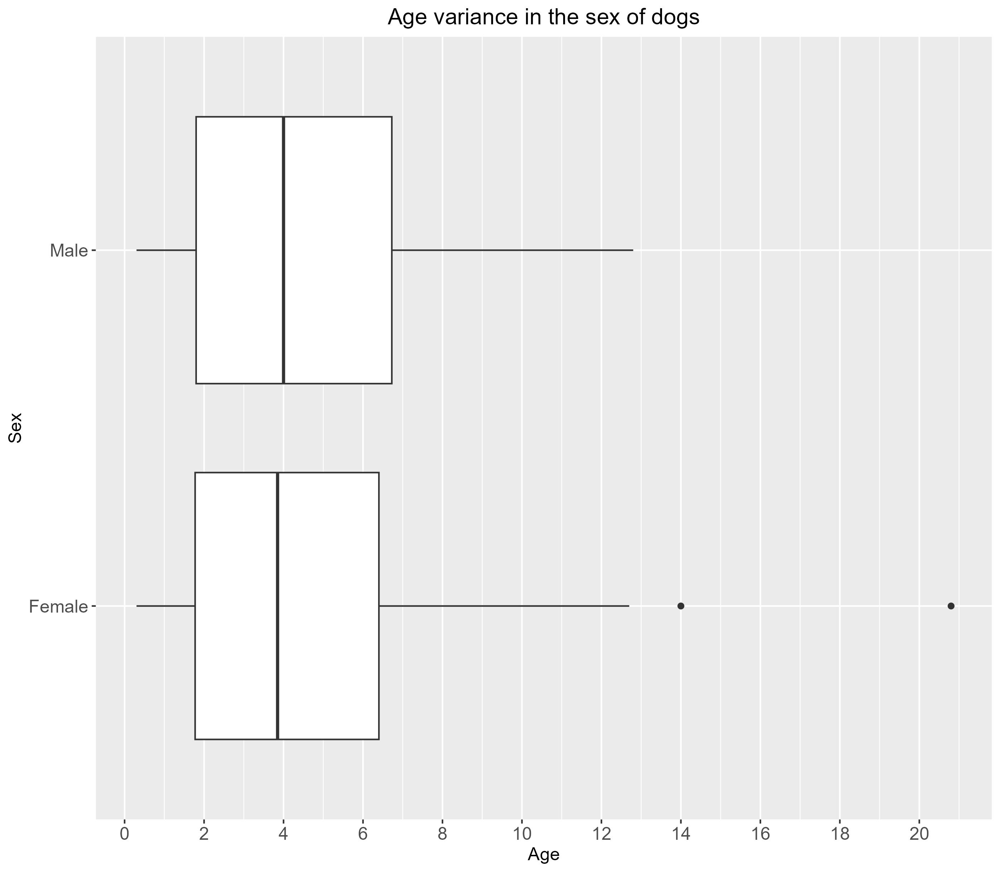
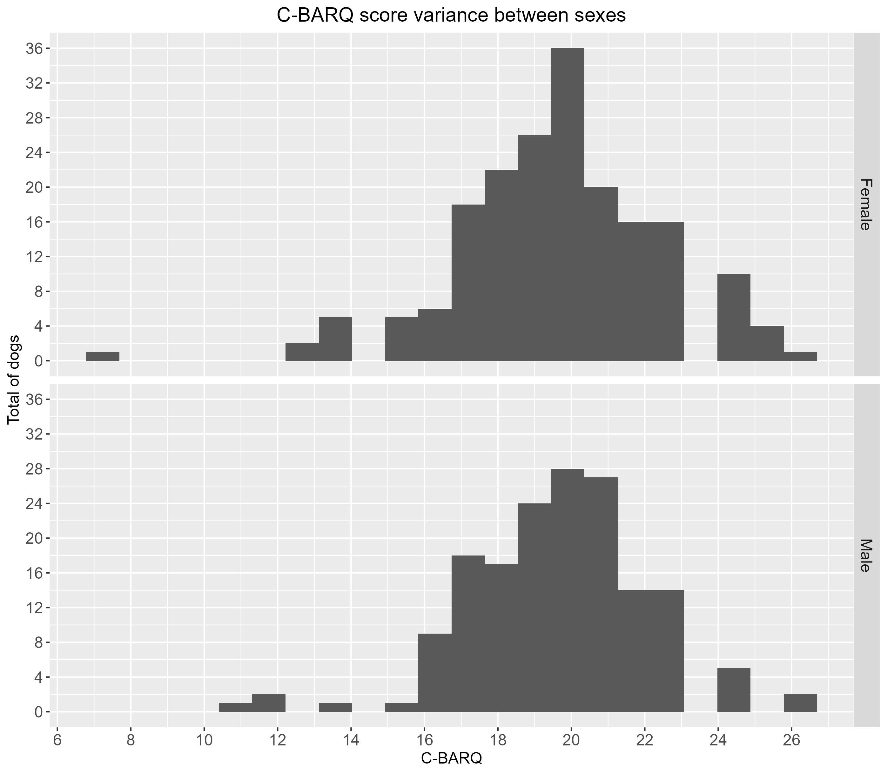

Dog Behavior Analysis Using C-BARQ
==================================

My Role
-------

I conducted an analysis of dog behavior using the Canine Behavioral Assessment and Research Questionnaire (C-BARQ) dataset. Involved data processing, statistical analysis, and visualisation to understand behavioral patterns in dogs.

### Key Contributions:

- **Data Processing and Cleaning**  
  Developed R scripts to:
  - Import and clean the ManyDogs dataset (455 records).
  - Handle missing values (147 dogs with incomplete data).
  - Calculate C-BARQ scores (range 0-32) by summing 8 behavioral dimensions.

- **Statistical Analysis**  
  Performed extensive analysis including:
  - Descriptive statistics for age, sex, and living environment.
  - Distribution analysis of C-BARQ scores.
  - Comparative analysis between sexes and age groups.
  - Correlation studies between behavioral traits.

- **Research** 
  Integrated findings with academic literature:
  - Explained C-BARQ methodology and scoring.
  - Results within working dog selection.
  - Cited primary sources (Hsu & Serpell, ManyDogs Project).

- **Technical Implementation** 
    - Comprehensive documentation and commenting throughout the project.
    - Used a variety of packages within R:
        - `Tidyverse` for data manipulation.
        - `ggplot2` for visualisation.

- **Data Visualisation** 
  Created informative graphs:
  - Box plots showing age distribution by sex.
  - Histograms of C-BARQ score distributions.
  - Comparative plots of behavioral traits.
  - Properly labeled all graphs with titles, axes, and legends.

    
    &nbsp;
    

Key Findings
------------
- Dataset contains 455 dogs with average age ~4.4 years.
- 90.2% of dogs lived in homes.
- Female dogs showed more behavioral variance but generally better scores.

References
----------
1. C-BARQ, Serpell, J., University of Pennsylvania (2024) About the C-BARQ. Canine Behavioral Assessment & Research Questionnaire. DOI: https://vetapps.vet.upenn.edu/cbarq/about.cfm.
2. ManyDogs Project, Espinosa, J., Hare, E., Alberghina, D., Valverde, B.M.P., and Stevens, J.R. (2024). Data from the ManyDogs 1. Journal of Open Psychology Data, 12:7, pp. 1
-26. DOI: https://doi.org/10.5334/jopd.109.